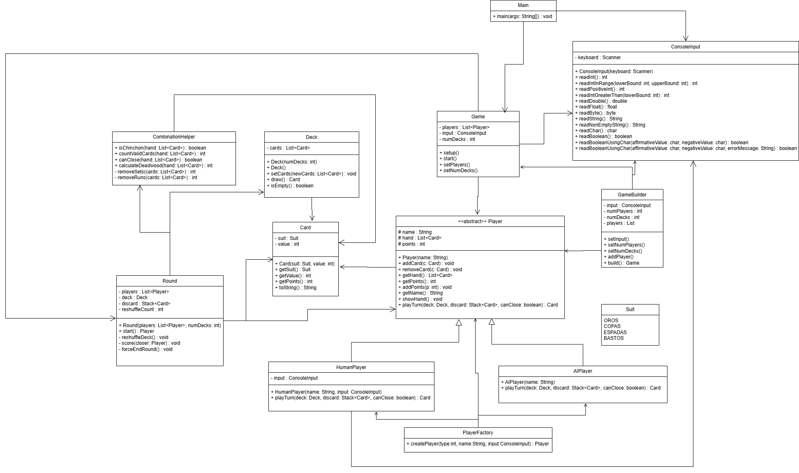

# Chinchón en Java

# 1. Descripción General

## Introducción

Este proyecto implementa una versión del juego de cartas **Chinchón** utilizando Java y programación orientada a objetos.

La aplicación permite disputar partidas completas entre jugadores humanos y jugadores controlados por inteligencia artificial (IA), gestionando automáticamente el reparto de cartas, turnos, combinaciones válidas, puntuación y eliminación de jugadores.

El desarrollo se ha realizado aplicando principios de diseño orientado a objetos, documentación JavaDoc, pruebas unitarias y patrones de diseño.

---

# 2. Explicación del Juego

## Objetivo

El objetivo principal del juego es terminar la partida con la menor cantidad de puntos posible.

Los jugadores deben formar combinaciones válidas de cartas para reducir los puntos de las cartas sueltas.

Un jugador puede ganar de dos formas:

* Consiguiendo un **Chinchón**.
* Siendo el último jugador que no supera el límite de puntos establecido.

---

## Características principales

* Juego completo por consola.
* Soporte para jugadores humanos.
* Soporte para jugadores IA.
* Configuración del número de jugadores.
* Configuración del número de barajas.
* Sistema automático de puntuación.
* Detección automática de combinaciones.
* Detección automática de Chinchón.
* Eliminación de jugadores al alcanzar el límite de puntos.

---

## Baraja utilizada

Se utiliza la baraja española:

### Palos

* Oros
* Copas
* Espadas
* Bastos

### Valores

* 1
* 2
* 3
* 4
* 5
* 6
* 7
* 10 (Sota)
* 11 (Caballo)
* 12 (Rey)

El juego permite utilizar:

* 1 baraja
* 2 barajas

---

## Desarrollo de una partida

### Reparto inicial

Al comenzar una ronda:

* Cada jugador recibe 7 cartas.
* Se crea un mazo principal.
* Se coloca una carta boca arriba en la pila de descarte.

---

### Turno de un jugador

Durante cada turno el jugador:

1. Roba una carta.

   * Del mazo.
   * O del descarte.

2. Decide si puede cerrar la ronda.

3. Descarta una carta.

Al finalizar el turno siempre debe mantener 7 cartas.

---

## Combinaciones válidas

### Tríos o grupos

Tres o más cartas del mismo valor.

Ejemplo:

3 - 3 - 3

---

### Escaleras

Tres o más cartas consecutivas del mismo palo.

Ejemplo:

5 de Oros - 6 de Oros - 7 de Oros

---

### Chinchón

Siete cartas consecutivas del mismo palo.

Ejemplo:

1 - 2 - 3 - 4 - 5 - 6 - 7

Si un jugador consigue un Chinchón gana automáticamente la partida.

---

## Cierre de ronda

Un jugador puede cerrar cuando:

* No se encuentra en el primer turno de la ronda.
* Tiene al menos 6 cartas formando combinaciones válidas.

Situaciones posibles:

### 6 cartas combinadas

Queda una carta suelta.

### 7 cartas combinadas

Obtiene una bonificación de -10 puntos.

### Chinchón

Victoria inmediata.

---

## Sistema de puntuación

Cuando un jugador cierra:

* Se calculan las cartas no combinadas de todos los jugadores.
* Cada jugador suma esos puntos a su marcador.

Valor de las cartas:

| Carta   | Puntos        |
| ------- | ------------- |
| 1-7     | Valor nominal |
| Sota    | 10            |
| Caballo | 11            |
| Rey     | 12            |

---

## Fin de la partida

La partida finaliza cuando:

* Todos los jugadores excepto uno superan el límite de puntos.

Límite utilizado:

100 puntos.

El ganador es el último jugador que permanece por debajo del límite.

---

# 3. Capturas de Pantalla

## Ejecución del juego


---

## Pruebas unitarias


---

# 4. Análisis del Proyecto

## Tecnologías utilizadas

* Java 21
* Eclipse IDE
* JUnit 5
* JavaDoc

---

# 5. Estructura del Proyecto

```text
ProyectoChinchon/

├── src/
│   └── ejercicio/
│       ├── Main.java
│       ├── Game.java
│       ├── Round.java
│       ├── Player.java
│       ├── HumanPlayer.java
│       ├── AIPlayer.java
│       ├── PlayerFactory.java
│       ├── GameBuilder.java
│       ├── Deck.java
│       ├── Card.java
│       ├── Suit.java
│       ├── CombinationHelper.java
│       └── ConsoleInput.java
│
├── tests/
│   └── pruebas unitarias
│
├── docs/
│   └── JavaDoc generado
│
└── README.md
```

## Descripción de carpetas

### src

Contiene todo el código fuente de la aplicación.

### tests

Contiene las pruebas unitarias realizadas con JUnit.

### docs

Contiene la documentación JavaDoc generada automáticamente.

---

# 6. UML

## Diagrama de clases



Interpretación del UML

El diagrama UML refleja una arquitectura modular donde cada clase tiene una responsabilidad clara.

* Game controla el flujo global
* Round gestiona cada ronda
* Player define comportamiento base
* Deck gestiona cartas
* CombinationHelper encapsula la lógica del juego

---

# 7. Descripción de Clases

## Main

Punto de entrada de la aplicación.

---

## Game

Gestiona la partida completa.

Responsabilidades:

* Configurar jugadores.
* Iniciar rondas.
* Determinar ganador.

---

## Round

Gestiona una ronda individual.

Responsabilidades:

* Reparto de cartas.
* Gestión de turnos.
* Cálculo de puntuaciones.

---

## Player

Clase abstracta que representa cualquier jugador.

---

## HumanPlayer

Implementa la interacción por consola para jugadores humanos.

---

## AIPlayer

Implementa el comportamiento automático de la inteligencia artificial.

---

## Card

Representa una carta de la baraja.

---

## Deck

Representa y gestiona el mazo de cartas.

---

## Suit

Enumeración de palos de la baraja.

---

## CombinationHelper

Clase utilitaria encargada de:

* Detectar Chinchón.
* Detectar combinaciones.
* Calcular puntos.

---

## ConsoleInput

Gestiona la lectura segura de datos desde consola.

---

## PlayerFactory

Fábrica encargada de crear jugadores.

---

## GameBuilder

Construye objetos Game mediante configuración progresiva.

---

# 8. Patrones de Diseño Utilizados

## Patrón Factory Method

### Clase

```java
PlayerFactory
```

### Código

```java
PlayerFactory.createPlayer(...)
```

### Justificación

Permite crear diferentes tipos de jugadores sin que la clase Game conozca los detalles de construcción.

### Ventajas

* Bajo acoplamiento.
* Fácil ampliación.
* Código más mantenible.

---

## Patrón Builder

### Clase

```java
GameBuilder
```

### Código

```java
Game game = new GameBuilder()
    .setInput(input)
    .setNumPlayers(3)
    .setNumDecks(1)
    .build();
```

### Justificación

Permite construir un objeto complejo paso a paso sin utilizar constructores largos.

### Ventajas

* Mayor legibilidad.
* Facilita configuraciones futuras.
* Reduce errores de inicialización.

---

# 9. Pruebas Unitarias

## Enfoque utilizado

Se han desarrollado pruebas utilizando JUnit 5.

Para cada funcionalidad importante se han realizado pruebas siguiendo dos enfoques:

### Caja Blanca

Analizan la lógica interna del código.

Ejemplos:

* isChinchon()
* canClose()
* calculateDeadwood()

Se verifican caminos de ejecución y condiciones internas.

---

### Caja Negra

Validan entradas y salidas sin considerar la implementación interna.

Ejemplos:

* Creación de jugadores.
* Robar cartas.
* Cálculo de puntuaciones.

---

## Evidencias

Las siguientes capturas muestran la ejecución correcta de los tests:


---

# 10. JavaDoc

Toda la aplicación se encuentra documentada mediante JavaDoc.

La documentación incluye:

* Clases.
* Métodos.
* Parámetros.
* Valores de retorno.

La documentación generada puede consultarse en:

```text
/docs/index.html
```

---

# 11. Conclusiones

El proyecto implementa una versión funcional del juego Chinchón utilizando programación orientada a objetos.

Durante el desarrollo se han aplicado:

* Herencia.
* Polimorfismo.
* Encapsulación.
* Clases abstractas.
* Enumeraciones.
* Patrones de diseño Builder y Factory.
* Pruebas unitarias con JUnit.
* Documentación JavaDoc.

El resultado es una aplicación modular, mantenible y fácilmente ampliable para futuras mejoras.